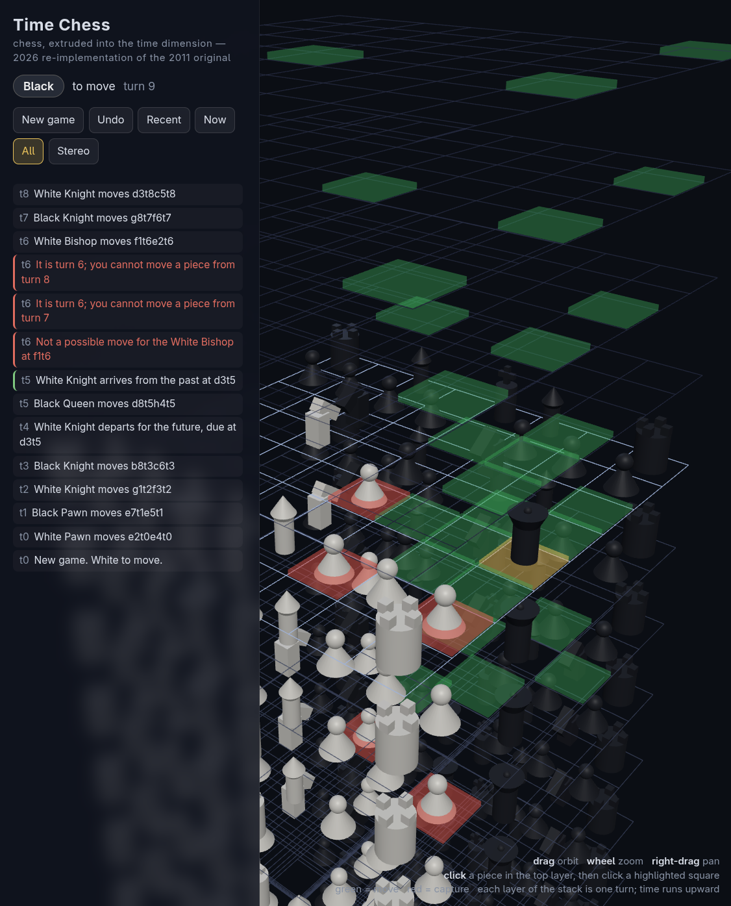

# Time Chess (2026 re-implementation)

A modern, browser-based re-implementation of the 2011 G53IDS dissertation
project: chess extruded into the time dimension, played on a growing stack of
boards where each layer is one turn. Pieces move through space *and* time,
capture their opponents' pasts, and occasionally get Lost in Time.



See [REPORT.md](REPORT.md) for what changed relative to the 2011 original —
bugs found and fixed, rules clarifications, architecture, and performance.

## Run the game

No build step and no dependencies to install (Three.js is vendored). ES
modules need to be served over HTTP, so from this directory:

```sh
python3 -m http.server 8621
# then open http://localhost:8621/
```

(or `npx serve`, or any static file server.)

### Hosting it (GitHub Pages etc.)

The whole directory is plain static files — no build step, no server-side
code, all paths relative — so it can be published anywhere that serves
files, including GitHub Pages project sites (which serve under a subpath):

1. Copy the contents of this directory into the repository (root or
   `docs/`), including `vendor/` and the `.nojekyll` file (it stops GitHub
   running the site through Jekyll).
2. In the repository settings, enable Pages for that branch/folder.

That's the complete deployment. Visitors get the 3D board and the AI
opponent (playing Black by default) with nothing to install; the AI runs
entirely in the visitor's browser, in a Web Worker.

### Controls

| Input | Effect |
|---|---|
| left-drag | orbit the camera |
| right-drag | pan |
| wheel | zoom |
| click a piece in the top layer | select it; legal moves highlight (green = move, red = capture) |
| click a highlighted square | make that move |
| `n` / `r` / `a` | show Now only / Recent turns / All turns |
| `s` | red/blue anaglyph stereo (for red/blue glasses, as in the original) |
| `u` | undo (against the AI it takes back its reply and your move together) |
| `c` | AI move: the built-in AI plays one move for the side to move |
| `h` | the how-to-play guide (also opens automatically on first visit) |
| `Esc` | close the guide / deselect |

By default the page is set to **AI plays Black**: make a move as White and
the AI answers by itself. The dropdowns in the panel choose who the AI plays
for (Black, White, both, or nobody) and how long it thinks per move. The
search runs in a Web Worker, so the page stays fully interactive while the
AI is thinking.

Semi-transparent "ghost" pieces mark where forward time travellers will
re-enter the timeline. Hover anything for a readout of what it is and where
(and when) it stands.

A debug handle is exposed in the browser console:
`timeChess.move('a2t0a4t0')`, `timeChess.engine.prettyPrint(3)`, etc.

## Engine, tests, tools (Node ≥ 18)

The rules engine is a single pure ES module, `src/engine.js`, with no
dependencies — the same file runs in the browser and in Node.

```sh
node --test test/engine.test.js   # 29 tests: ports of the 2011 suite + regression tests
node --test test/ai.test.js       # 9 tests for the AI player
node bench.js                     # rough performance numbers
node tcecp.js                     # the original's TCECP protocol over stdin/stdout
node aiplay.js --white=ai --black=random --ms=1000   # watch the AI play
```

`src/ai.js` is an alpha-beta game-playing AI for Time Chess — the
dissertation's headline further-work item. See
[AI-REPORT.md](AI-REPORT.md) for what a standard chess-engine approach
does and does not survive in this game.

### Rules additions (2026)

Two draw rules the 2011 design left out, added so games always end:

- **Threefold repetition of the reachable past.** No move reaches more than
  7 turns back, so the last 8 board layers (plus the future queue and side
  to move) are the complete game state; the third occurrence of the same
  window is a draw. Full histories never repeat in Time Chess — this window
  is the only repetition that means anything.
- **Fifty-move rule.** Fifty moves per side without a capture, a loss to
  time, or a pawn move is a draw (repetition alone cannot adjudicate a dead
  K-vs-K wander on a board this big).

`tcecp.js` speaks the Time Chess Engine Communication Protocol from the
dissertation appendix (`new`, `ping N`, `a1t0`, `a2t0a4t0`, `getState ...`),
so anything written against the 2011 engine interface still works.

## Layout

```
index.html        the game page (UI shell, import map)
src/engine.js     rules engine — pure, dependency-free, browser + Node
src/ai.js         AI player — alpha-beta search + evaluation (see AI-REPORT.md)
src/ui.js         Three.js interface
test/             node:test suites (engine + AI)
tcecp.js          TCECP stdin/stdout adapter (Node)
aiplay.js         AI vs AI / AI vs random games from the terminal (Node)
bench.js          benchmark (Node)
vendor/           Three.js r170 + the addons used (vendored; works offline)
```
